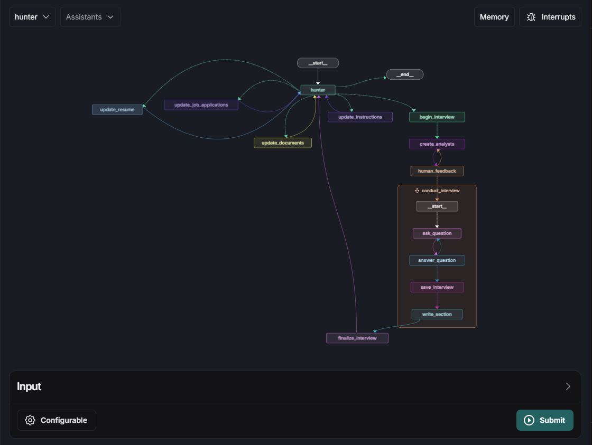

# UnemployeesVs

### Setup

Create a conda environment with python 3.11

```bash
conda create -n hunter python=3.11
conda activate hunter
```
Clone this repo and install the required packages

```bash
git clone https://github.com/imbulana/UnemployeesVS.git

cd UnemployeesVS
python3 -m pip install -r requirements.txt
```

Setup Docker using the instructions found [here](https://docs.docker.com/engine/install) if you do not already have Docker set up.

Then, create a `.env` following the `.env-example` with your openAI and LangChain API keys entered.

Additionally, navigate to `backend/deployment` and create a `docker-compose.yml` file following the `docker-compose-example.yml` file with the API keys filled in.

To use the chat UI app, install the following packages and dependencies

```bash
sudo apt-get update                 # update packages
sudo apt-get install nodejs npm     # install node.js and npm
sudo npm install -g pnpm            # install pnpm
pnpm -v                             # verify installation

cd frontend
pnpm install                        # install dependencies
cd ..
```

### Usage

Deploy locally with LangGraph

```bash
cd backend/deployment
langgraph build -t hunter-0
docker compose up
```

Run the chat UI app locally

```bash
cd frontend
pnpm dev
```

Follow the forwarded port and enter your

- Local deployment URL
- Graph ID: hunter
- LangSmith API key


You can also interact with the agent via LangGraph studio.

To do so, sign in to [LangSmith website](https://smith.langchain.com/) on your browser and navigate to the LangGraph Platform tab and launch LangGraph Studio




### [Demo Usage Video](https://drive.google.com/file/d/1bKYv5_1ReoccnZfbohWsKySeWMOvwAOl/view?usp=sharing)

### Agent Workflow

#### Job Seeker Facing

There are three key aspects in this agent workflow.

- **Long Term Memory**: The "hunter" agent has access to various types of long-term memory related to the user's professional and academic career, with the goal of creating a candidate persona that mimics the user's experiences, skills, and accomplishments. 

- **AI Roleplay**: When a user is ready to apply for a job interview, they can simply say so, and the hunter agent will initiate the interview process by creating analysts who will interview the candidate in the user's stead. This process involves generating a set of analysts informed by the job posting and the user's resume. The analysts will begin by asking questions to the candidate, drawing on the user's profile. The interview roleplay will continue, with the analysts creating memos that report on the candidate's strengths and weaknesses. A final evaluation of the candidate's fit for the job, as assessed by each analyst, will be provided.

- **Human-in-the-Loop**: Before the expert analysts conduct their interviews, the user is prompted to verify that they are satisfied with the personas of the analysts. If the user wants the analysts to focus on a specific aspect of their professional or academic career, they can simply say so, and the agent will generate appropriate analysts who meet the user's requirements. 

This system leverages human-in-the-loop feedback to refine insights by integrating user inputs, ensuring personalized suggestions for improving the user's resume. AI roleplay simulates realistic interviews, allowing the system to evaluate responses, while long-term memory stores insights and improvements for continuous resume enhancement over multiple sessions.

#### Recruiter Facing

The agentic workflow enables recruiters gain a greater and granular understanding of the candidates while requiring minimal effort. Recruiter's are able to get valuable insights into the potential strengths and weaknesses of a candidate via the lens of expert analysts.